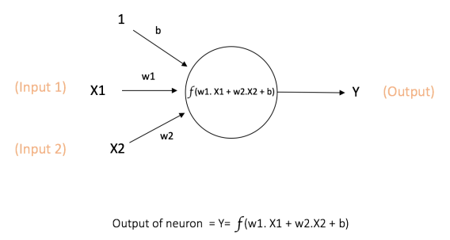

#人工神经网络的介绍

[链接](https://ujjwalkarn.me/2016/08/09/quick-intro-neural-networks/)

# 多层感知机（Multi Layer Perceptron）

## 单个神经元

神经网络中的基本计算单元称之为`神经元`，或者`节点`、`单元`。简单说就是从外部接收一个输入，计算产生一个输出。每个输入都带有权重。

上述的神经元有两个输入：`X1`和`X2`，权重分别为`w1`和`w2`,以及一个权重为`b`的输入`l`，称之为`偏差`输入。函数`f`是非线性的，称之为`激活函数`（`Activation Function`）。

`偏差`输入主要的功能是为每个`神经元`提供一个可训练的常量。[解释](https://stackoverflow.com/questions/2480650/role-of-bias-in-neural-networks)

## 前反馈神经网络（Feedforward Neural Network）

## 问题

[深度学习和机器学习的区别](https://github.com/rasbt/python-machine-learning-book/blob/master/faq/difference-deep-and-normal-learning.md)
[神经网络和深度神经网络的区别](https://stats.stackexchange.com/questions/182734/what-is-the-difference-between-a-neural-network-and-a-deep-neural-network-and-w?rq=1)
[深度学习和多层感知机的区别](https://www.quora.com/How-is-deep-learning-different-from-multilayer-perceptron)
