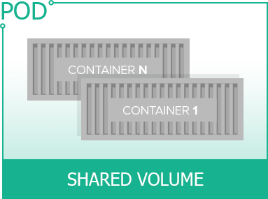
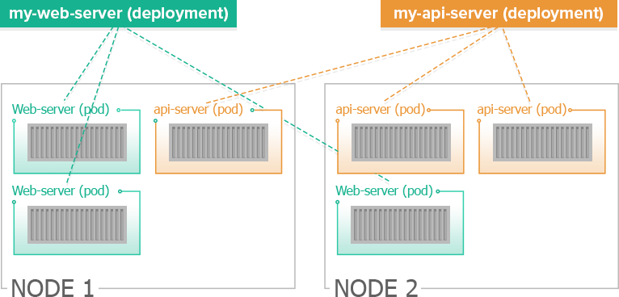
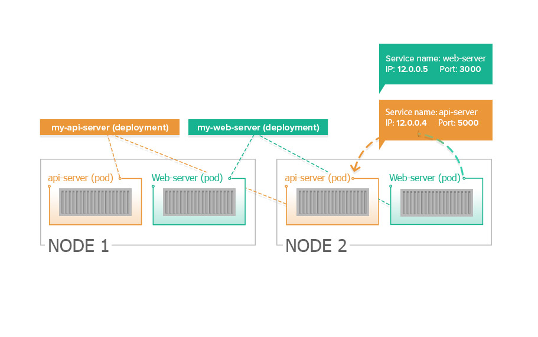

# 概念介绍

## Pods
`pod`是`kubernetes`引入的新概念，指的是一个最小单位可部署的实体。
- 容器总是运行在`pod`里面
- 一个`pod`通常运行着一个或多个容器
- 在相同`pod`里的容器被认为是在相同的机器上以及共享资源

如果几个容器间是紧耦合以及共享`I/O`资源的话，那么这些容器可以部署同一个`pod`中。

## Deployment
理论上，我们可以手动操作`Pods`，可以启动、监控、停止它们。但是实际上，会采用一个称之为`Deployment`的方式来操作`Pods`。`Deployment`不仅可以操作单个`Pod`，它可以管理`Pod`的副本集（`replica set`）。

`Deployment`与`Pod`的关系：
- `Pod`指定要运行的`image`
- `Deployment`则是指定运行`Pod`的实例个数

`Deployment`有以下功能：
- 为服务创建一个`pod`实例（或多个）
- 监测这些`pod`实例，确保它们在线以及是否健康运行。如果有其中一个实例出了问题，`Deployment`会自动创建一个新的`pod`来代替它

之后还可以：
- 进一步扩大或缩小`pod`的实例个数
- 上线新的特性到`pod`中（可以是新的镜像）
- 回滚到老的`pod`

## Services
`Deployment`之后，我们需要将我们的服务暴露给外界或者内部，以提供我们的功能，这时就需要`Service`。`Service`会为服务暴露`固定的IP`和`端口`，访问这些`IP`会被路由到相应的`Pod`中。

每个`Pod`都会分配一个`IP`。当集群中的一个`Pod`下线后，请求会被路由到集群中的另一些`Pod`。默认情况下，`Kubernetes`的`DNS服务`是暴露`服务名`给所有的`Pod`。
