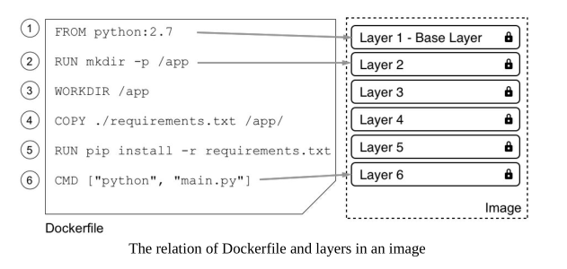
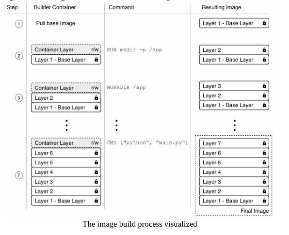

# 创建

## 交互式创建
简单说就是在已有的镜像的基础上，再次修改和提交。

以 `alpine` 为例：
运行容器：
> docker run -it --name sample alpine /bin/sh

增加新包，支持 `ping` 等操作：
> / # apk update && apk add iputils

此时就可以使用 `ping` 等程序：
> / # ping 127.0.0.1

定制修改完后，退出容器：
> / # exit

查看容器的差异：
> docker diff sample

列表中， `C` 表示的改变的文件， `A` 表示的是新增的文件， `D` 表示的是删除的文件。

提交修改，生成新的镜像：
> docker commit sample my-alpine

查看镜像列表：
> docker images

查看 `my-alpine` 镜像的提交历史：
> docker image hisotry my-alpine

## Dockerfile
以 `Dockerfile` 作为清单，用来创建镜像。`Dockerfile` 是一系列命令组合而成的一个文件。每一个命令都会在其基础层上创建一个新的层。例如：
```
FROM python:2.7
RUN mkdir -p /app
WORKDIR /app
COPY ./requirements.txt /app/
RUN pip install -r requirements.txt
CMD ["python", "main.py"]
```

其层结构为：




- FROM: 镜像的基础镜像层。一个特例就是：
    ```
    FROM scratch
    ```

    以 `scratch` 作为基础层实际上不会在镜像中新增一个层。

- RUN: 运行任意的合法的 Linux 命令。
- COPY 和 ADD: 都是用来往镜像层中增加数据。区别就是 ADD 一个压缩包的话，会被解压；同时源文件可以是 URL。
- WORKDIR: 定义工作目录或者上下文。
- CMD 和 ENTRYPOINT: 这两个命令用来指明镜像在运行期的行为。可就是告诉 Docker 当容器起来时，执行哪个进程以及如何执行。它们的区别是 ENTRYPOINT 定义运行的程序；而 CMD 则定义程序的运行参数。 CMD 中也可以执行程序而不依赖 ENTRYPOINT 。同时， CMD 参数可以在容器启动时被覆盖， ENTRYPOINT 也可以使用 --entrypoint 来覆盖。
    ```
    FROM alpine:latest
    ENTRYPOINT ["ping"]
    CMD ["8.8.8.8", "-c", "3"]
    ```
    在只有 CMD 的情况下，将会使用默认的  /bin/sh -c ，比如：
    ```
    FROM alpine:latest
    CMD wget -O - http://www.google.com
    ```
    在容器内部其实是这样执行的：

    > /bin/sh -c "wget -O - http://www.google.com"

镜像创建的整个过程：



### 多阶段构建
参照 `multiStepBuilds`

### 最佳实践
- 首先，得认为容器声明周期是短暂的。因为生命期短暂，所以在容器的启动、停止和销毁的配置时间就需要短，间接地，容器内运行的程序的初始化和终止的时间就需要尽可能的短。
- 应该讲各个命令进行特定的排序，尽可能利用缓存。在开发过程中，可能需要经常构建镜像操作，因此利用缓存能够加快镜像的构建速度。根据镜像分层原理，底层数据的发生变化后，顶层也需要重新构建。比如有以下例子：
    ```
    FROM node:9.4
    RUN mkdir -p /app
    WORKIR /app
    COPY . /app
    RUN npm install
    CMD ["npm", "start"]
    ```
    第5行的 `RUN npm install` 通常会花费较长的时间，这根据工程对外部的依赖情况而定。在开发过程中，经常变动的是源文件，这也意味着第4行会经常性地变化，从而也就导致了第5行很难利用缓存。为了避免此种情况，可以对 Dockerfile 做出以下调整：
    ```
    FROM node:9.4
    RUN mkdir -p /app
    WORKIR /app
    COPY package.json /app/
    RUN npm install
    COPY . /app
    CMD ["npm", "start"]
    ```
- 尽肯能将镜像层保持少。层越少，容器启动就越快。保持镜像层少的其中一个做法就是将多个命令合并在一起。比如有以下命令：
    ```
    RUN apt-get update
    RUN apt-get install -y ca-certificates
    RUN rm -rf /var/lib/apt/lists/*
    ```
    按照上述命令，会在镜像中创建3个层。而以下写法只会创建1个：
    ```
    RUN apt-get update \
        && apt-get install -y ca-certificates \
        && rm -rf /var/lib/apt/lists/*
    ```
- 尽可能将镜像的大小保持小。因为镜像体积小，所有下载的时间就短，加载到内存中的内存消耗也小，同时也意味着更小的受攻击面。通常可以通过以下做法来实现：
    - 使用 `.dockerignore` 来避免不必要的文件拷贝
    - 避免在镜像层中安装不要的依赖包或者临时文件
    - 使用多阶段构建（multistage builds）

## 压缩包

从 `tarball` 中导入，根据导入到系统的内容创建。本质上，镜像文件就是一个压缩包。因此可以使用 `save` 和 `load` 来保存和导入镜像。
> docker save -o ./backup/my-alpine.tar my-alpine

然后从 `tar` 包中导出（或者说加载）
> docker load -i ./backup/my-alpine.tar


# 共享与分发镜像

在对镜像共享之前，都会对镜像打上标签，然后将其推送到一个称之为 `image registries` 的服务器上。

## 打标签
每个镜像都会有个标签，经常用于版本控制。如果没有特别指定，这个值为 `latest` 。

## 镜像命名空间
默认情况下，拉取镜像都是从 `Docker Hub` 。一个完整的镜像格式是这样的：

> <registry URL>/<User or Org>/<name>:<tag>

- <registry URL> 镜像的中央仓库路径
- <User or Org> 用来指明用户或者组织的 ID
- <name> 镜像的名称
- <tag> 镜像的标签

例如：
> https://hub.docker.com/navono007/fn

在拉取镜像的时候，有些惯例：
- 如果省略 `registry URL` ，则自动使用 `Docker Hub`
- 如果省略 `tag` 则默认为 `latest`
- 如果是 `Docker Hub` 的官方镜像，则可以不指定用户或者组织的ID

## 将镜像推送至 Registry
推送前首先需要给镜像打标签，标签中指明了 `User iD` ， `name` 和 `tag` 。例如：
> docker tag apline:latest navono007/alpine:1.0

然后登陆到 registry ，例如：
> docker login -u navono007 -p password

最后就是推送：
> docker push navono007/apline:1.0
