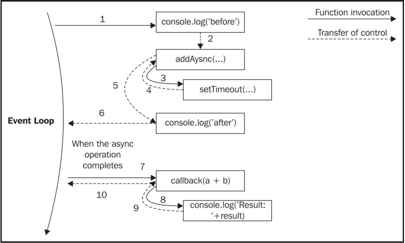

<!-- TOC -->

- [回调模式](#回调模式)
  - [CPS - Continuation-Passing Style](#cps---continuation-passing-style)
    - [同步CPS](#同步cps)
    - [异步CPS](#异步cps)
    - [非CPS风格的回调](#非cps风格的回调)
- [模块系统及其模式](#模块系统及其模式)
- [观察者模式（Event Emitter）](#观察者模式event-emitter)

<!-- /TOC -->

# 回调模式
`回调`是`Reactor模式`中handler的具化。另外一个实现`回调`的方式是`闭包`。

## CPS - Continuation-Passing Style
在`JavaScript`中，`回调`会被当做参数传递给一个函数，之后执行完的结果会通过`调用回调`来通知最初的操作发起方。在`FP`中，这种传递结果的方式称之为`Continuation-Passing Style (CPS)`。这是个通用的概念，简单来说就是操作结果不直接返回给调用方，而是通过调用另外一个函数（回调）来传递。

### 同步CPS
普通的函数，通常会通过`return`将结果返回给调用方：
```js
function add(a, b) {
  return a + b;
}
```

同等的`CPS`风格就是调用一个回调参数，然后将结果传递给这个回调：
```js
function add(a, b, callback) {
  callback(a + b);
}
```
上述的`add`就是一个同步的CPS函数。它只有在`callbakc`执行完才会把控制权交还给调用方。

```js
console.log('before');
add(1, 2, result => console.log('Result: ' + result));
console.log('after');
```
输出：
```
before
Result: 3
after
```

### 异步CPS
如果将上述例子改成异步CPS，只需要在调用`callback`改成异步即可。
```js
function addAsync(a, b, callback) {
  setTimeout(() => callback(a + b), 100);
}
```

测试代码：
```js
console.log('before');
addAsync(1, 2, result => console.log('Result: ' + result));
console.log('after');
```
输出：
```
before
after
Result: 3
```

`setTimeout`会触发一个异步操作，它不会等待回调执行完毕而是直接将控制权交还给调用方。这个和`Event Loop`在用户执行完回调后，会重新获取控制权一样，这样接下来的事件才能够被处理。

下图是上面`addAsync`的整个流程：


### 非CPS风格的回调


# 模块系统及其模式

# 观察者模式（Event Emitter）
