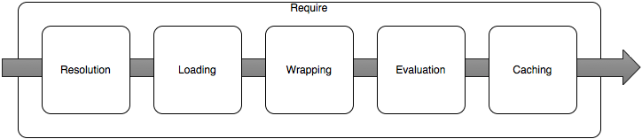

<!-- TOC -->

- [模块机制](#模块机制)
  - [CommonJS](#commonjs)
  - [ECMAScript module](#ecmascript-module)
  - [ECM和CommonJS的区别](#ecm和commonjs的区别)
- [热更新](#热更新)
- [上下文](#上下文)
- [包管理](#包管理)

<!-- /TOC -->
# 模块机制
模块是代码结构的基础构件块。模块系统主要是用来组织代码，隐藏细节，通过`module.exports`来暴露公共接口。使用`require`来加载模块。在`ES2015`之前，`node`使用`CommonJS`来管理模块。

`add.js`提供一个简单的`add`函数：
```js
// add.js
function add(a, b) {
  return a + b;
}

module.exports = add;
```
使用`add`函数：
```js
// index.js
const add = require('./add');
console.log(add(4, 5));
// 9
```
在底层，`add.js`会被`Node.js`包装成：
```js
(function (exports, require, module, __filename, __dirname) {
  function add (a, b) {
    return a + b
  }

  module.exports = add
})
```
这样就可以使用全局的变量，类似`require`和`module`，同时它也确保了声明在文件内的变量的作用域被限定在文件中，而不是在全局作用域中。


`Node.js`的模块使用缓存加载机制，也就是会在第一次使用`require`时加载模块，之后多次加载同一个模块都只是直接使用缓存。

## CommonJS
整个过程可以看成这样：


- 第一步：解析路径
  <br>通过指定标识符`add`，解析到一个`Node.js`能理解的决定文件路径。这里需要设计到一系列的查找路径，匹配的对象包括`原生模块`、`.js文件`、`.json文件`。最终的结果就是一个可以被`Node.js`加载的指定到`add`的绝对路径文件。

- 第二步：加载
  <br>如果在`第一步`解析到的是一个`原生模块`，那么`Node.js`会找到相应的共享库，然后链接到当前的node.js进程中。如果`第一步`解析到的是一个`.js`或`.json`文件，先判断文件是否存在，是的话那么会将文件的内容读入到内存中。

  <br>`加载js文件`和`评估js（Evaluating the JS）文件`不一样。
  <br>加载js文件指的是将文件的字符串形式的内容加载到内存中
  <br>评估js文件指的是将字符串内容传递给`JS的VM`用来解析和评估。

- 第三步：包装
  <br>在从字符串内容到进入`VM`解析和评估之前，需要将其包装到一个函数中。
  ```js
  (function (exports, require, module, __filename, __dirname) {
    function add (a, b) {
      return a + b
    }

    module.exports = add
  })
  ```
  
- 第四步：Evaluation
  <br>接下来就是使用JS的运行时来评估此包装后的函数。包装函数本质上是一个工厂方法。导出的对象是个普通的`JS`对象。包装函数附加了`定义的函数`和`属性`到导出的对象上。一旦包装函数返回，那么导出的对象就会被缓存，同时作为返回值欸`require`方法。

  <br>这里关于`CommonJS`模块机制最主要的一点是：无法提前知道哪些符号会被导出，知道JS文件的内容（包装函数）被评估之后。
  
  <br>上述机制是和`ECMAScript module`机制最本质的区别。`ECMAScript module`是导出是`词法`形式，意思就是`ESM`的导出符号在JS代码被解析的时候就被确定下来了，这是在真正的`评估（Evaluation）`之前。

## ECMAScript module
[modules](https://hackernoon.com/node-js-tc-39-and-modules-a1118aecf95e)


## ECM和CommonJS的区别
1. CommonJS 模块输出的是一个值的拷贝，ES6 模块输出的是值的引用。
    - CommonJS 模块输出的是值的拷贝，也就是说，一旦输出一个值，模块内部的变化就影响不到这个值。
    - ES6 模块的运行机制与 CommonJS 不一样。JS 引擎对脚本静态分析的时候，遇到模块加载命令import，就会生成一个只读引用。等到脚本真正执行时，再根据这个只读引用，到被加载的那个模块里面去取值。换句话说，ES6 的import有点像 Unix 系统的“符号连接”，原始值变了，import加载的值也会跟着变。因此，ES6 模块是动态引用，并且不会缓存值，模块里面的变量绑定其所在的模块。

2. CommonJS 模块是运行时加载，ES6 模块是编译时输出接口。
    - 运行时加载: CommonJS 模块就是对象；即在输入时是先加载整个模块，生成一个对象，然后再从这个对象上面读取方法，这种加载称为“运行时加载”。
    - 编译时加载: ES6 模块不是对象，而是通过 export 命令显式指定输出的代码，import时采用静态命令的形式。即在import时可以指定加载某个输出值，而不是加载整个模块，这种加载称为“编译时加载”。


# 热更新

# 上下文

# 包管理