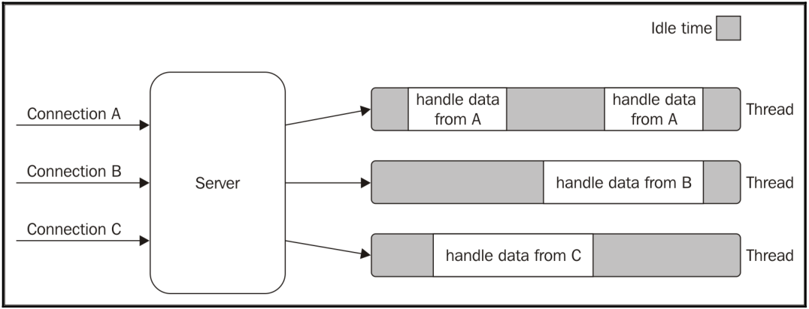

<!-- TOC -->

- [小内核（Small core）](#小内核small-core)
- [小模块（Small modules）](#小模块small-modules)
- [暴露最小的API集（Small surface area）](#暴露最小的api集small-surface-area)
- [简单实用（Simplicity and pragmatism）](#简单实用simplicity-and-pragmatism)
- [Reactor模型](#reactor模型)
  - [I/O](#io)
    - [阻塞 I/O](#阻塞-io)
    - [非阻塞 I/O](#非阻塞-io)
  - [事件多路复用（Event demultiplexing）](#事件多路复用event-demultiplexing)
  - [reactor模型](#reactor模型)

<!-- /TOC -->

# 小内核（Small core）
`Node.js`的核心是建立在几个少数原则之上。其中之一就是核心实现最小的功能（集合），其他的则留给用户（userland，or userspace），这些生态系统（模块）是在核心之外的。这样的好处是，用户可以快速验证、迭代自己的解决方案，而不是把一些特定的问题的解决与内核强绑定，强加给内核去实现。保持核心功能集合的最小化，不仅在内核维护上更便利，同时也给整个生态圈的进化带来了正向的影响。

# 小模块（Small modules）
`Node.js`采用`模块（module）`的概念来作为程序的基础构件块，可重用库称之为`包（package）`。同时一个重要的原则是设计小的模块，这不仅指的是代码量（`code size`）小，也指的是其解决的问题范围（`scope`）。

这个原则和`Unix的设计哲学`是一致的：
- "Small is beautifull."
- "Make each program do one thing well."

借助与`npm` -- 官方的包管理平台，`Node.js`通过每一个已安装的包都有其自己依赖，解决了`dependency hell`问题。

除了可重用的好处，设计一个模块通常认为还需要考虑以下几点：
- 易于理解和使用
- 更简单的测试与维护
- 倾向于通过浏览器来共享

# 最小暴露原则（Small surface area）
这个原则其实`Small modules`原则的一个扩展，在`“小”`的基础上，暴露最简单易用的API给用户。因为API暴露的越多，越复杂，对于使用者来说，就越会被误用。同时也与`Small modules`的理念相违背。所以在一个包的导出中，通常会一个构造函数或者直接是一个函数，以这样的方式就提供了一个清晰的、易用的且很难被误用的`入口（entry point）`。

很多`Node.js`模块的另一个特性就是，它们被创建出来是拿来`使用`的，而 __不是__ 拿来`被扩展`的。这会使得模块的内部实现会变得更简单，用例更清晰，也很容易维护，同时增加了可用性。

# 简单实用（Simplicity and pragmatism）
简单来说就是`KISS`, __Keep It Simple, Stupid__ 或者也可以说 __Keep It Stupid Simple__。

设计简单实用的，而不是完美、全功能的软件，总的来说有几个好处：
- 实现简单
- 快速发行
- 易于维护和理解

其实这个原则是基于`软件架构`是会随着业务需求改变而`进化`的一个理念，而不是一开始就设计一个架构复杂，实现也耗时的软件。因为我们没办法在最一开始就遇见以后的变化。因此将软件设计成`可进化`更重要。

# Reactor模型
## I/O
相对于`CPU`来说，`I/O`操作总是很慢的。这里说的`I/O`的执行速度相对于`CPU`的执行速度。但是从`I/O`执行方式来说，总的来说可以分为两种：
### 阻塞 I/O
阻塞I/O指的是从发起一次I/O操作请求，要等到此操作完成，等待的时间取决与具体的I/O操作，在等待期间，执行的线程是阻塞的，无法去执行其他任务。对于此I/O模型的系统，基本会使用多线程或多进程来处理并发。

### 非阻塞 I/O
相对于阻塞I/O，很多操作系统支持非阻塞I/O。

## 事件多路复用（Event demultiplexing）

## reactor模型
